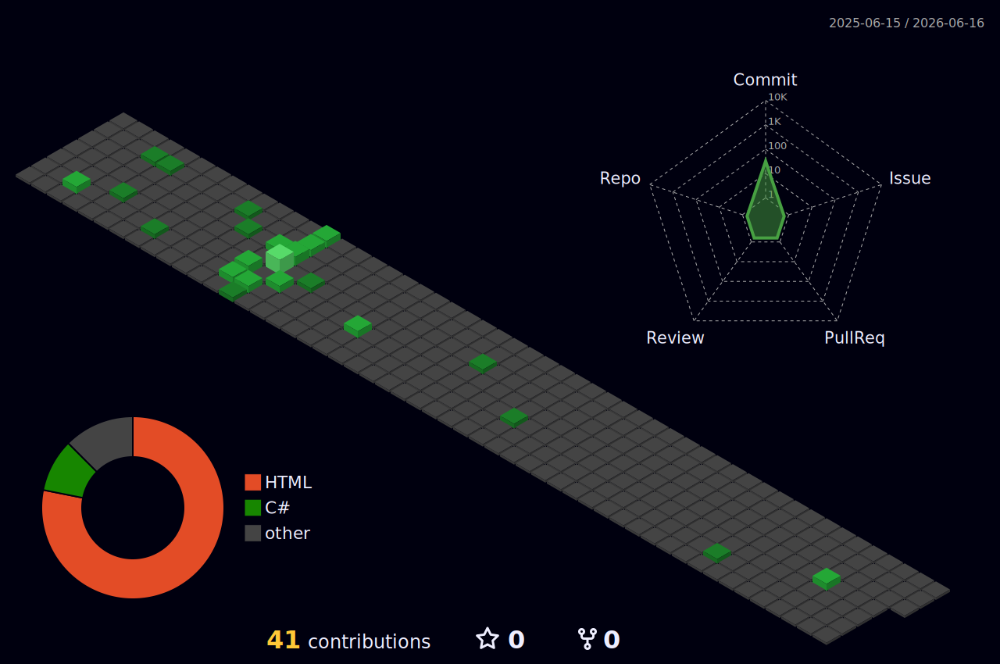

<h1 align="center"><b>Hey there! I'm Amiraldo, Programmer </b></h1>

## About Me

I'm Amiraldo — a full-stack developer interested in web development, games, and 3D. I work with **JavaScript**, **TypeScript**, **Python**, **PHP**, and **C#**, and I also explore tools like **Unity** and **Blender** for 3D and interactive projects.

### ⚡Objectives

- To evolve as a full-stack developer and deepen knowledge in game development and 3D graphics.

- To build projects that combine web applications and interactive 3D experiences.

- To contribute to open-source projects and learn good software engineering practices.

- To seek collaboration opportunities, freelance work, or formal positions in the development field.

### 💻Where am I currently

Currently, I'm focused on personal projects and hands-on learning: I develop web applications, practice 3D design, and contribute to the community (see the `profile-3d-contrib` folder). I'm open to collaborations and new opportunities—contact me via LinkedIn or the email listed above.

If you'd like to see examples of my work, check out my repositories and projects on this profile. Alternatively, send me a message: I'd love to discuss collaboration or job openings.
	

<h2 align="center">🛠️ Tech Stack</h2>
 

Languages:
 
  
Frameworks & Libraries:
 
  
Databases:
 
  
Tools & Others:
 
 

  
- **Extras**:

 
  
  
  
   
 

 

|  |  | 
| ----------- | ----------- |

