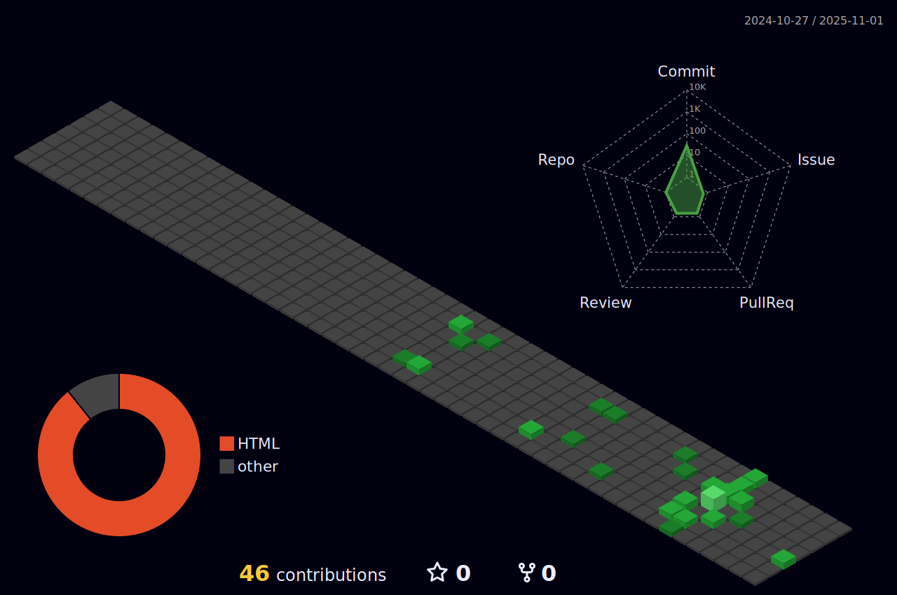

<h1 align="center"><b>Hey there! I'm Amiraldo, Programmer </b></h1>
	
- **Full Stack Development**:
 
 
  
  
  
  
  
  
  
  
  
  
  
  

   
  
- **Extras**:

 
  
  
  
   
 

 

|  |  | 
| ----------- | ----------- |

